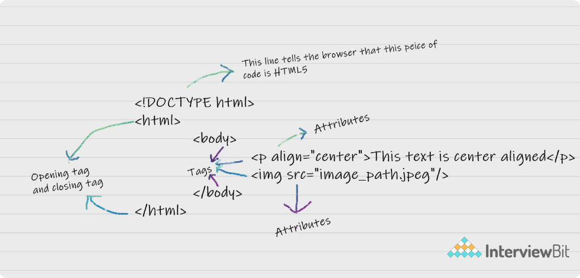
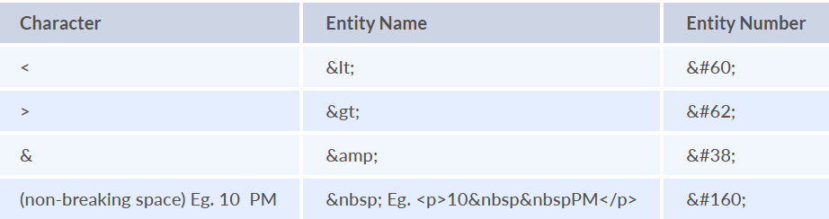
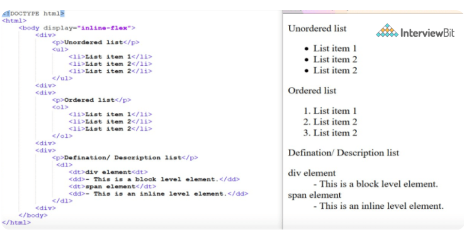
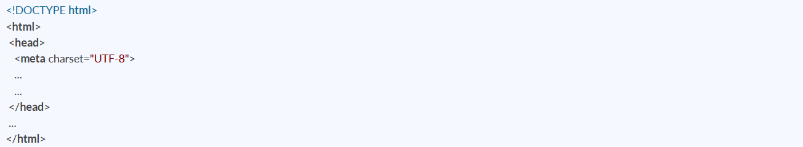

0. What is HTML?

HTML **HyperText Markup Language** (GiperMatn Belgilash Tili) ning qisqartmasidir. Bu veb sahifalarni ishlab chiqish uchun ishlatiladigan standart matnni formatlash tilidir va 1993 yilda chiqgan. HTML — bu brauzer tomonidan talqin qilinadigan til bo‘lib, u brauzerga qanday ma'lumotlarni ko‘rsatish va ularni qanday tarzda ko‘rsatish kerakligini bildiradi.

HTML — bu veb-dizaynerlar va veb-ishlab chiquvchilar uchun muhim til, chunki u veb sahifalarining **strukturasi**ni yaratish uchun ishlatiladi. Biroq, faqat HTML bilan veb-ishlab chiqish yetarli emas, chunki HTML faqat brauzerda sahifada ko‘rsatiladigan ma'lumotlar strukturasini belgilaydi. Sahifani ko‘rinarli va jozibador qilish uchun **CSS** (Cascading Style Sheets - Kaskadli Stil Jadvallari), funksionallikni qo‘shish uchun esa **JavaScript** kerak bo‘ladi.

Eng so‘nggi HTML versiyasi **HTML5** hisoblanadi. HTML tilining ikkita asosiy komponenti mavjud: **Teglar** (Tags) va **Atributlar** (Attributes). Quyidagi rasmda ba'zi asosiy HTML teglar va atributlar ko‘rsatilgan.

1. Can we display a web page inside a web page or Is nesting of webpages possible?

Ha, biz bir veb sahifani boshqa HTML veb sahifasi ichida ko‘rsatishimiz mumkin. HTML **`<iframe>`** tegi orqali biz ushbu funksiyani amalga oshirishimiz mumkin.

2. What are tags and attributes in HTML?

Teglar HTMLning asosiy komponenti bo'lib, u tarkib qanday tuzilishini/formatlanishini belgilaydi, atributlar esa elementning xususiyatlarini aniqlash uchun HTML teglari bilan birga ishlatiladi. Masalan, 
Intervyu savollari
, bunda “align” atribut bo‘lib, uning yordamida biz paragrafni ko‘rinish markazida ko‘rsatish uchun tekislaymiz.

3. What are void elements in HTML?

HTML elementlari, yopilish tegiga ega bo'lmagan yoki yopilishi shart bo'lmagan elementlar **Void elementlar** deb ataladi. Masalan, ` `, ``, `
` kabi elementlar bunga misol bo'la oladi.

4. What is the advantage of collapsing white space?

HTMLda, bo'shliq belgilari ketma-ketligi bitta bo'shliq belgisi sifatida qabul qilinadi, chunki brauzer bir nechta bo'shliqlarni bitta bo'shliq belgisiga birlashtiradi. Bu esa dasturchilarga matnlarni qatorda joylashni osonlashtiradi, bir nechta bo'shliqlar haqida xavotirlanmasdan, HTML kodlarini o'qilishi va tushunilishini saqlashga yordam beradi.

5. What are HTML Entities?

HTMLda ba'zi belgilar ajratilgan bo'lib, ular maxsus ma'noga ega, masalan: `<`, `>`, `/` va boshqalar. Agar biz ushbu belgilarni veb-sahifamizda ishlatmoqchi bo'lsak, ularni **HTML entitilari** deb ataladigan maxsus belgilar yordamida ishlatishimiz kerak. Quyida ajratilgan belgilar va ularning tegishli HTML entitilari orasidagi ba'zi moslashuvlarni ko'rishingiz mumkin:

- `<` → `&lt;`
- `>` → `&gt;`
- `&` → `&amp;`
- `"` → `&quot;`
- `'` → `&apos;`

Bu HTML entitilari maxsus belgilarni HTML hujjatlarida to'g'ri ishlatish uchun kerak bo'ladi.

6. What are different types of lists in HTML?

7. What is the ‘class’ attribute in HTML?

`class` atributi HTML elementiga sinf nomini belgilash uchun ishlatiladi. HTMLdagi bir nechta elementlar bir xil sinf qiymatiga ega bo'lishi mumkin. Shuningdek, bu atribut asosan stil varaqasida yozilgan uslublarni HTML elementlari bilan bog'lash uchun ishlatiladi.

9. Define multipart form data?

`enctype` atributining qiymatlaridan biri **multipart/form-data** bo'lib, bu serverga fayl ma'lumotlarini yuborish uchun ishlatiladi. Ushbu qiymat fayllarni yuklash uchun maxsus formatni belgilaydi. `enctype` atributining boshqa yaroqli qiymatlari esa **text/plain** va **application/x-www-form-urlencoded** dir.

10. Describe HTML layout structure.

Har bir veb-sahifa turli komponentlarga ega bo'lib, u maqsadli kontentni va maxsus foydalanuvchi interfeysini (UI) ko'rsatadi. Ammo, ba'zi elementlar mavjud bo'lib, ular veb-sahifani tuzishda global ravishda qabul qilingan shablonlardir, masalan:

- `<header>`: Veb-sahifaning boshlang'ich ma'lumotlarini saqlaydi.
- `<footer>`: Sahifaning oxirgi bo'limini ifodalaydi.
- `<nav>`: HTML sahifasining navigatsiya menyusi.
- `<article>`: Ma'lumotlar to'plami.
- `<section>`: Sahifaning asosiy tuzilmasini belgilash uchun `article` blokida ishlatiladi.
- `<aside>`: Sahifaning yon paneli (sidebar) kontenti.

11. How to optimize website assets loading?

Veb-saytning yuklash vaqtini optimallashtirish uchun uning aktivlarini yuklashni optimallashtirish zarur, buning uchun quyidagi usullarni qo'llash mumkin:

- **CDN hosting**: CDN (Content Delivery Network) — bu serverlarning geografik ravishda tarqatilgan tarmog'i bo'lib, u kechikishni (latency) kamaytirishga yordam beradi.
- **Faylni siqish (File compression)**: Bu usul aktivning hajmini kamaytirish orqali ma'lumotlar uzatish hajmini qisqartirishga yordam beradi.
- **Fayllarni birlashtirish (File concatenation)**: Bu usul HTTP chaqiruvlarining sonini kamaytiradi.
- **Scriptlarni minifikatsiya qilish (Minify scripts)**: Bu usul JS va CSS fayllarining umumiy hajmini kamaytiradi.
- **Paralel yuklash (Parallel downloads)**: Aktivlarni bir nechta subdomenlarda joylashtirish, barcha zamonaviy brauzerlarda har bir domen uchun 6 aktiv yuklash cheklovini chetlab o'tishga yordam beradi. Bu sozlamalar o'zgartirilishi mumkin, ammo ko'plab foydalanuvchilar bu sozlamalarni o'zgartirmaydi.
- **Lazy Loading**: Barcha aktivlarni bir vaqtning o'zida yuklash o'rniga, faqat zarur bo'lganda, ya'ni kerakli vaqtda yuklanadigan aktivlar yuklanadi.

12. What are the various formatting tags in HTML?

HTMLda turli formatlash teglar mavjud:

- `<b>` — matnni qalin qiladi.
- `<i>` — matnni kursiv qiladi.
- `<em>` — matnni kursiv qiladi, lekin qo'shimcha semantik ahamiyatga ega bo'ladi.
- `<big>` — matnning shrift hajmini bitta birlikka kattalashtiradi.
- `<small>` — matnning shrift hajmini bitta birlikka kichiklashtiradi.
- `` — matnni pastki indeks (subscript) qiladi.
- `` — matnni yuqori indeks (superscript) qiladi.
- `<del>` — matnni chizib o'chirilgan ko'rinishda ko'rsatadi.
- `<strong>` — matnni muhim deb belgilaydi.
- `<mark>` — matnni ajratib ko'rsatadi (highlight).
- `<ins>` — qo'shilgan matnni ko'rsatadi.

13. What are the different kinds of Doctypes available?

Mavjud bo'lgan uch xil Doctype turi:

1. **Strict Doctype** — Bu Doctype HTML yoki XHTML hujjatining qat'iy standartlarga amal qilishini belgilaydi. Bu turda eski yoki noma'lum elementlar va atributlar qo'llanilmaydi.
   
2. **Transitional Doctype** — Bu Doctype eski HTML elementlari va atributlariga ruxsat beradi, lekin imkon qadar zamonaviy standartlarga rioya qilishni talab qiladi. Bu turda eski elementlar bilan yangi elementlar o'rtasidagi moslashuvni qo'llab-quvvatlashga imkon beradi.

3. **Frameset Doctype** — Bu Doctype, asosan, freymlar (frames) bilan ishlaydigan veb-sahifalar uchun ishlatiladi. Ushbu Doctype HTML freymlarini ishlatishga imkon beradi, lekin zamonaviy veb dizayni uchun ishlatilishi kamroq tavsiya etiladi.

14. Please explain how to indicate the character set being used by a document in HTML?

Belgilar to'plami (character set) `<meta>` tegida, `<head>` elementining ichida belgilangan bo'ladi.

15. What is the difference between <strong>, <b> tags and <em>, <i> tags?

Oddiy veb-sahifada `<strong>`, `<b>`, `<em>`, va `<i>` teglarining ta'siri bir xil bo'lishi mumkin. `<b>` va `<i>` teglar qalin va kursiv matnni ifodalaydi. Bu ikki teg faqat shriftni bezatish uchun ishlatiladi va `<b>` tegining o'zi faqat matnni yanada qoraytiradi, bu teglar matnning ma'nosiga hech qanday ta'sir qilmaydi.

Boshqa tomondan, `<strong>` va `<em>` teglar matnning kuchli ahamiyatga ega ekanligini yoki aniq ta'kidlanishi kerakligini bildiradi. `<strong>` tegini ishlatish matnni kuchliroq ahamiyatga ega deb belgilaydi, `<em>` esa matnga ta'kidli urg'u qo'shadi. Bu teglar semantik ma'noga ega bo'lib, matnning mazmunini anglatadi.

16. What is the significance of <head> and <body> tag in HTML?

`<head>` tegi hujjat haqida ma'lumotni taqdim etadi. U har doim `<html>` tegi ichida joylashgan bo'lishi kerak. Ushbu teg veb-sahifa haqida metadata va boshqa teglarni o'z ichiga oladi, masalan, `<link>`, `<meta>`, `<style>`, `<script>` va boshqalar. Ushbu teglar veb-sahifada ko'rsatilmaydi. Shuningdek, HTML hujjatida faqat bitta `<head>` tegi bo'lishi mumkin va u har doim `<body>` tegidan oldin joylashadi.

`<body>` tegi HTML hujjatining tanasini belgilaydi. U har doim `<html>` tegi ichida bo'lishi kerak. Veb-sahifada ko'rsatilishi kerak bo'lgan barcha kontent, masalan, rasmlar, matn, audio, video, va boshqa tarkiblar, `
`, ``, `<audio>`, `<h1>`, `<video>`, `
` kabi elementlar yordamida `<body>` tegining ichida joylashadi. HTML hujjatida faqat bitta `<body>` elementi bo'lishi mumkin va u har doim `<head>` tegidan keyin joylashadi.

17. Are the HTML tags and elements the same thing?

Yo'q. HTML elementlari boshlang'ich teg bilan belgilanadi, ichida kontent bo'lishi mumkin va yopilish tegi bilan tugaydi. Masalan, `<h1>Heading 1</h1>` — bu HTML elementi, lekin faqat `<h1>` — bu boshlang'ich teg, va `</h1>` — bu yopilish tegidir.

18. How is Cell Padding different from Cell Spacing?

**Cell Spacing** — bu ikki qo'shni hujayra orasidagi bo'shliq yoki farq.  
**Cell Padding** — bu hujayradagi matn yoki kontent bilan hujayraning cheti yoki chegarasi orasidagi bo'shliq yoki farq.

Farqni tushunish uchun yuqoridagi rasmga qarang.

19. How can we club two or more rows or columns into a single row or column in an HTML table?

HTML ikki ta'limot atributini taqdim etadi: **`rowspan`** va **`colspan`**, bu atributlar hujayraga bir nechta qatorlarga (rows) yoki ustunlarga (columns) cho'zilish imkonini beradi.

- **`rowspan`** — bu atribut hujayraning bir nechta qatorlarni egallashini belgilaydi.
- **`colspan`** — bu atribut hujayraning bir nechta ustunlarni egallashini belgilaydi.

20. Is it possible to change an inline element into a block level element?

Ha, bu mumkin. "display" xususiyati yordamida va uning qiymatini "block" qilib belgilash orqali inline elementni block-level (blok darajasidagi) elementga aylantirish mumkin.